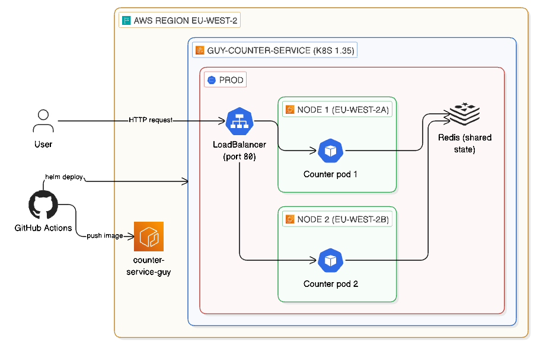

# Counter Service

A lightweight Python-based HTTP counter service deployed on EKS with a fully automated CI/CD pipeline.

**Live URL:** `http://acbb96b269b34451db1e15e097e3aadf-1121395566.eu-west-2.elb.amazonaws.com`

## Architecture



## Table of Contents

- [Application](#application)
- [Containerization](#containerization)
- [Infrastructure](#infrastructure)
- [Deployment (Helm)](#deployment-helm)
- [CI/CD Pipeline](#cicd-pipeline)
- [Persistence - Approach and Trade-offs](#persistence--approach-and-trade-offs)
- [High Availability and Scaling](#high-availability-and-scaling)
- [Security](#security)
- [Observability](#observability)
- [Production Considerations](#production-considerations)
- [Quick Start (Local)](#quick-start-local)

---

## Application

A fork of [shainberg/counter-service](https://github.com/shainberg/counter-service) with the following improvements:

- Redis-backed persistence (survives pod restarts)
- Health (`/healthz`) and readiness (`/readyz`) probes for Kubernetes
- Prometheus metrics endpoint (`/metrics`)
- Structured JSON logging to stdout
- Configuration via environment variables
- Non-root execution on port 8080 (mapped to 80 via K8s Service)
- 9 automated tests with `pytest`

### Endpoints

| Endpoint | Method | Description |
|----------|--------|-------------|
| `/` | GET | Returns the current counter value |
| `/` | POST | Increments the counter by 1 |
| `/healthz` | GET | Liveness probe |
| `/readyz` | GET | Readiness probe (checks Redis connectivity) |
| `/metrics` | GET | Prometheus metrics |

### Configuration

| Variable | Default | Description |
|----------|---------|-------------|
| `REDIS_HOST` | `localhost` | Redis server hostname |
| `REDIS_PORT` | `6379` | Redis server port |
| `PORT` | `8080` | Application listen port |
| `LOG_LEVEL` | `INFO` | Logging verbosity |
| `APP_VERSION` | `0.1.0` | Version identifier |

## Containerization

Multi-stage Docker build producing a minimal, secure image (~217MB):

- **Stage 1 (builder)** - installs dependencies into an isolated prefix.
- **Stage 2 (final)** - clean `python:3.12-slim` base with only the app and its dependencies.
- Runs as non-root user (`appuser`).
- Read-only root filesystem (writable `/tmp` via emptyDir).
- `gunicorn` as production WSGI server (2 workers).

```bash
docker build --platform linux/amd64 -t counter-service .
docker run -d -p 8080:8080 counter-service
```

## Infrastructure

All AWS infrastructure is managed with **Terraform** (`terraform/` directory).

### Resources provisioned

- **VPC** - 2 public subnets across 2 Availability Zones (eu-west-2a, eu-west-2b), internet gateway, route tables.
- **EKS cluster** (Kubernetes 1.35) - `STANDARD` support policy. Includes OIDC provider and EBS CSI driver addon.
- **Managed node group** - 2 `t3.medium` nodes spread across both AZs.
- **ECR repository** - private registry with image scanning on push and lifecycle policy (keeps last 10 images).
- **EBS encryption by default** - all new volumes in the region are encrypted automatically.

### Provision and connect

```bash
cd terraform
terraform init
terraform plan
terraform apply       # ~15 minutes

aws eks update-kubeconfig --name guy-counter-service --region eu-west-2
kubectl get nodes     # 2 nodes, Ready
```

### Tear down

```bash
terraform destroy
```

### Credentials

- AWS credentials via `aws configure` or environment variables. Never stored in code.
- `.gitignore` excludes `*.tfvars` and `*.tfstate`.
- CI/CD credentials stored as GitHub Actions encrypted secrets.

## Deployment (Helm)

The application is packaged as a Helm chart (`helm/counter-service/`).

### What gets deployed

| Resource | Purpose |
|----------|---------|
| Namespace (`prod`) | Isolates workloads |
| Deployment (2 replicas) | Runs the counter service |
| Service (LoadBalancer) | Exposes on port 80 |
| Redis Deployment + Service | Shared state for the counter |
| HorizontalPodAutoscaler | Scales 2–5 pods on CPU |
| PodDisruptionBudget | Keeps ≥1 pod during disruptions |
| ServiceAccount | Scoped identity for pods |
| StorageClass (gp3-encrypted) | Available for encrypted PVCs |

### Deploy manually

```bash
helm upgrade --install counter-service ./helm/counter-service \
  --set image.repository=<ECR_URL>
```

### Rollback

```bash
helm history counter-service
helm rollback counter-service <revision>
```

## CI/CD Pipeline

Defined in `.github/workflows/ci-cd.yaml`. Triggered on every push to `main`.

### Flow

```
Push to main → Test (pytest) → Build image → Push to ECR → Deploy to EKS → Verify rollout
```

- **Pull requests:** CI only (test). No build or deploy.
- **Push to main:** Full CI/CD. Image tagged with git commit SHA for traceability.
- **Rollback via git:** revert the commit, push - pipeline redeploys the previous version.

### Setup

1. Go to repo **Settings → Secrets and variables → Actions**.
2. Add `AWS_ACCESS_KEY_ID` and `AWS_SECRET_ACCESS_KEY`.
3. Push to `main` - pipeline runs automatically.

## Persistence - Approach and Trade-offs

The persistence approach evolved during the project.

**Initial approach: file with PVC.** The first implementation persisted the counter to a JSON file backed by an encrypted EBS PersistentVolumeClaim (gp3). This worked correctly for a single-replica deployment - the counter survived pod restarts because the EBS volume is independent of the pod lifecycle.

**The limitation:** when scaling to 2 replicas for HA, each pod would need its own PVC, resulting in independent counters. Multiple gunicorn workers within a pod had the same issue - each maintained its own in-memory counter. The service returned inconsistent values depending on which pod or worker handled the request.

**Current approach: Redis with PVC.** All pods connect to a single Redis instance. `redis.incr()` is atomic, so concurrent requests from multiple pods and workers are safe without application-level locking. Every GET returns the same value regardless of which pod handles it. Redis itself is backed by an encrypted PersistentVolumeClaim (gp3), so the counter survives Redis pod restarts as well.

**Other approaches considered:**

- **DynamoDB / RDS** - most durable, but overkill for a counter. Adds latency, cost, and infrastructure.
- **EFS (ReadWriteMany)** - shared filesystem, but concurrent writes need file locking. Higher latency than EBS.

## High Availability and Scaling

- **2 replicas** with shared state via Redis - if one pod dies, the other serves traffic while Kubernetes replaces it.
- **HPA** - auto-scales from 2 to 5 pods based on CPU (70% threshold).
- **PDB** - guarantees ≥1 pod available during voluntary disruptions (node drains, upgrades).
- **Pod anti-affinity** - prefers scheduling replicas on different nodes, spreading across AZs.
- **Multi-AZ nodes** - 2 worker nodes in eu-west-2a and eu-west-2b.

## Security

- **Non-root container** - runs as `appuser` (UID 1000).
- **Read-only root filesystem** - only `/tmp` (emptyDir) and `/data` (if PVC enabled) are writable.
- **No hardcoded secrets** - AWS credentials in GitHub Actions secrets, never in code.
- **Encrypted storage** - EBS encryption enabled by default across the region.
- **Minimal image** - multi-stage build, slim base, no build tools in final image.
- **Image scanning** - ECR scans images for vulnerabilities on push.
- **RBAC** - dedicated ServiceAccount for the counter service pods.

## Observability

- **Structured JSON logging** - all logs emitted as JSON to stdout, parseable by CloudWatch, Loki, ELK.
- **Prometheus metrics** - `/metrics` exposes `http_requests_total` (by method/endpoint/status) and `counter_current_value`.
- **Health probes** - Kubernetes monitors `/healthz` (liveness) and `/readyz` (readiness, checks Redis connectivity).

## Production Considerations

- **Private subnets with NAT Gateway** - nodes are in public subnets for simplicity. Production should use private subnets.
- **Remote Terraform state** - currently local. For teams, use S3 + DynamoDB locking.
- **AWS OIDC for CI/CD** - the pipeline uses static AWS access keys in GitHub Secrets. In production, I would use AWS OIDC federation so GitHub Actions gets temporary credentials per run, with no long-lived keys to manage or risk leaking.
- **Sealed Secrets / External Secrets** - for better secret management, audit trails, and rotation.
- **Canary deployments** - enhance the rolling update strategy with Argo Rollouts for gradual traffic shifts.
- **Grafana dashboard** - Prometheus metrics are exposed and ready for scraping and visualization.
- **Distributed tracing** - for a single-service API with one Redis call, tracing adds limited value. In a microservices architecture, OpenTelemetry would help identify cross-service latency bottlenecks.

## Quick Start (Local)

```bash
# Run tests (no Redis required - uses fakeredis)
pip install -r requirements.txt
pytest test_app.py -v

# Run locally (requires a Redis instance on localhost:6379)
python app.py

# Test
curl http://localhost:8080/
curl -X POST http://localhost:8080/
```
